# 🚀 The Battle of Rogue

**A 2D space shooter game built in C++20 for the Sandpiper embedded platform (ARM Cortex-A9 + NEON).**


---

## 📖 Description

*The Battle of Rogue* is a retro-style vertical space shooter designed for the **Activision Studio Summit 2026 programming competition**. The game runs on the Sandpiper hardware platform — a custom ARM Cortex-A9 board with NEON SIMD extensions — rendering at a native resolution of **320×240** using 8-bit indexed color.

Players pilot a spacecraft, battling waves of enemies across multiple levels. Between levels, players choose upgrades for themselves **and** for the enemy, creating a unique risk/reward dynamic. The game features sprite-sheet animations, particle trails, firework effects, easing-based animations, high-score persistence with name entry, and background music powered by the libxmp tracker module player.

### ✨ Features

- **State-machine architecture** — clean separation of game phases (menu, battle, upgrades, end game, high scores).
- **Object pooling** — zero-allocation gameplay via compile-time-sized pools for planes, bullets, explosions, trails, and more.
- **Upgrade system** — 8 distinct improvements (triple shot, penetration, explosion rounds, shields, etc.) applied to player *or* enemy.
- **Parallax starfield** — three depth layers of stars with configurable trails for a sense of speed.
- **Meteorite hazards** — destructible obstacles that cross the battlefield.
- **Firework celebrations** — particle-based fireworks on the high-score screen.
- **Analog controller input** — supports USB game controllers via UDP relay, Bluetooth HID, and keyboard fallback.
- **Tracker music** — background music using the libxmp XM/IT/S3M/MOD player.
- **Performance profiling** — optional Chrome-compatible trace output for frame and section timing.

---

## 🏗️ Project Structure

```
game/
├── src/                        # Game source code
│   ├── Main.cpp                # Entry point and game loop
│   ├── GameManager.h/cpp       # Central game orchestrator
│   ├── GameConfig.h            # Master configuration aggregator
│   ├── State.h                 # Abstract base class for game states
│   ├── BattleState.h/cpp       # Core combat gameplay state
│   ├── MainMenuState.h/cpp     # Title screen state
│   ├── InitialMovementState.h/cpp  # Level-start animation state
│   ├── ImprovementSelectionState.h/cpp # Upgrade picker state
│   ├── EndGameState.h/cpp      # Game-over screen state
│   ├── HighScoreState.h/cpp    # High-score entry & display state
│   ├── WorldObject.h           # Base class for all game entities
│   ├── Plane.h/cpp             # Player and enemy spacecraft
│   ├── Bullet.h/cpp            # Projectiles
│   ├── Meteorite.h             # Asteroid obstacles
│   ├── Explosion.h             # Animated explosion effect
│   ├── Star.h                  # Background parallax stars
│   ├── Firework.h/cpp          # Celebratory particle fireworks
│   ├── Pool.h                  # Generic compile-time object pool
│   ├── Spawner.h               # Timed object spawner (template)
│   ├── Painter.h/cpp           # Low-level framebuffer rendering
│   ├── PainterManager.h/cpp    # Sprite registry and draw-call batching
│   ├── SpriteSheetController.h/cpp # Sprite-sheet animation controller
│   ├── InputManager.h/cpp      # Controller / keyboard input
│   ├── SoundManager.h/cpp      # Background music (libxmp)
│   ├── EasingManager.h/cpp     # Pooled tweening / easing system
│   ├── Ease.h/cpp              # Individual easing curve
│   ├── NumberManager.h/cpp     # Numeric text rendering
│   ├── RandomManager.h/cpp     # Random number generation
│   ├── TrailManager.h/cpp      # Visual trail particle system
│   ├── ButtonA.h/cpp           # Timed analog-input selector
│   ├── Profiler.h              # Optional performance profiler
│   ├── Sprites.h               # Embedded pixel-art sprite data
│   ├── Sprites_scaled.h        # Scaled sprite variants
│   ├── controller.h/c          # Low-level controller driver (C)
│   └── config/                 # Compile-time configuration headers
│       ├── ScreenConfig.h
│       ├── PoolConfig.h
│       ├── DefaultValuesConfig.h
│       ├── ImprovementsConfig.h
│       ├── LevelConfiguration.h
│       ├── EnemyConfiguration.h
│       ├── BattleStateConfig.h
│       ├── TimesConfig.h
│       ├── ScoreConfiguration.h
│       ├── CoordsConfig.h
│       ├── MainMenuConfig.h
│       ├── MeteoritesConfiguration.h
│       ├── StarsConfiguration.h
│       ├── FireworkConfig.h
│       ├── HighScoreConfiguration.h
│       └── TrailConfiguration.h
├── SDK/                        # Sandpiper hardware SDK
│   ├── include/                # Platform, VPU, VCP, APU headers
│   └── src/                    # SDK source (NEON math, platform)
├── 3rdparty/
│   └── libxmp/                 # XM/IT/S3M/MOD tracker player library
├── Sounds/                     # Embedded sound data headers
├── images/                     # Sprite source images and conversion tools
├── build/                      # Build artifacts
├── bin/                        # Compiled object files
├── Makefile                    # Cross-platform build system
└── todo.md                     # Development task tracker
```

---

## 🔷 UML Class Diagram

```mermaid
classDiagram
    direction TB

    %% ──────────── Game Entities ────────────
    class WorldObject {
        <<abstract>>
        #float _X
        #float _Y
        #float _alpha
        #SpriteSheetController _spriteController
        +Paint(PainterManager*) void
        +Update(float deltaTime) void
        +ConfigureSprite(PainterManager*) void
        +GetX() float
        +GetY() float
        +SetPosition(float, float) void
        +GetWidth() unsigned int
        +GetHeight() unsigned int
        +SetAlpha(float) void
        +SetPlayerTeam(unsigned char) void
    }

    class Plane {
        -float _fireRate
        -int _bulletsTotalSources
        -bool _hasShield
        -int _bulletsPerShot
        -bool _bulletIsBig
        -float _timeInmortal
        -TrailManager* _trailManager
        +Update(float) void
        +Paint(PainterManager*) void
        +Reset(float) void
        +SetCallbackFire(function) void
        +SetFireRate(float) void
        +SetHasShield(bool) void
        +SetBulletIsBig(bool) void
    }

    class Bullet {
        -float _velocityX
        -float _velocityY
        -bool _hasPenetration
        -bool _hasExplosion
        -bool _isBig
        +Update(float) void
        +SetVelocity(float, float) void
        +SetHasPenetration(bool) void
        +SetHasExplostion(bool) void
    }

    class Meteorite {
        -float _velocityX
        -float _velocityY
        -bool _moveLeft
        +Update(float) void
        +SetVelocities(float, float) void
        +OutOfScreen() bool
    }

    class Explosion {
        -function _callbackEnd
        +Update(float) void
        +SetCallbackEnd(function) void
        +GetSize(uint, uint) void
    }

    class Star {
        -float _velocityX
        -float _velocityY
        -Type _typeStar
        -bool _hasTrail
        +Update(float) void
        +OutOfScreen() bool
        +GetSprite() SPRITE_ID
    }

    class Firework {
        -float _minY
        -bool _inExplosion
        -TrailManager* _trailManager
        -array~MiniFirework~ _minFireworks
        +Configure(TrailManager*, float, float, float) void
        +Update(float) void
        +Paint(PainterManager*) void
        +OutOfScreen() bool
    }

    WorldObject <|-- Plane
    WorldObject <|-- Bullet
    WorldObject <|-- Meteorite
    WorldObject <|-- Explosion
    WorldObject <|-- Star
    WorldObject <|-- Firework

    %% ──────────── Spawner (also a WorldObject) ────────────
    class Spawner~T,N~ {
        -Pool~T,N~ _objects
        -float _delaySpawn
        -function _configureCallback
        -function _updateCallback
        +Update(float) void
        +Paint(PainterManager*) void
        +Reset() void
    }

    WorldObject <|-- Spawner~T,N~

    %% ──────────── State Machine ────────────
    class State {
        <<abstract>>
        #Plane* _player
        #PainterManager* _painterManager
        #NumberManager* _numberManager
        #EasingManager* _easingManager
        #RandomManager* _randomManager
        #ButtonA* _buttonAManager
        +Update(float, float) STATES
        +Paint() void
        +PaintUI() void
        +OnEnter() void
        +OnExit() void
    }

    class BattleState {
        -Pool~Plane~ *_enemiesPool
        -Pool~Bullet~ *_bulletsPool
        -Pool~Explosion~ _explosionPool
        -int _currentLevel
        +Update(float, float) STATES
        +SetCurrentLevel(int) void
    }

    class MainMenuState {
        -STATES _nextState
        -bool _startingGame
        +Update(float, float) STATES
    }

    class InitialMovementState {
        -Pool~Plane~* _enemiesPool
        -int _enemiesMoving
        +Update(float, float) STATES
    }

    class ImprovementSelectionState {
        -ImprovementID _leftSelection
        -ImprovementID _rightSelection
        -function _callbackSeleccion
        +Update(float, float) STATES
        +Configure(ImprovementID, ImprovementID) void
    }

    class EndGameState {
        -float _playerScore
        +Update(float, float) STATES
        +Configure(float) void
    }

    class HighScoreState {
        -array~Score~ _bestscores
        -Spawner~Firework~ _spawnerFirework
        -TrailManager* _trailManager
        +Update(float, float) STATES
        +Configure(float) void
    }

    State <|-- BattleState
    State <|-- MainMenuState
    State <|-- InitialMovementState
    State <|-- ImprovementSelectionState
    State <|-- EndGameState
    State <|-- HighScoreState

    %% ──────────── Managers ────────────
    class GameManager {
        -Plane _player
        -Pool~Plane~ _enemiesPool
        -Pool~Bullet~ _bulletsPool
        -EasingManager _easingManager
        -ButtonA _buttonAManager
        -NumberManager _numberManager
        -Spawner~Star~ _spawnerStars
        -Spawner~Meteorite~ _spawnerMeteorites
        -RandomManager _randomManager
        -TrailManager _trailManager
        -map~STATES,State*~ _statesLogic
        +Update(float) bool
        +Paint() void
    }

    class PainterManager {
        -Painter* _painter
        -map~SPRITE_ID,uint8_t*~ _sprites
        -array~data~ _toPaint
        +Paint() void
        +AddToPaint(SPRITE_ID, float, float) void
        +ClearListPaint() void
        +GetSpriteSize(SPRITE_ID, uint, uint) void
    }

    class Painter {
        -SPPlatform* s_platform
        +BeginPaint() void
        +EndPaint() void
        +PaintBackground() void
        +PaintItem(...) void
    }

    class InputManager {
        +GetInputValue() int
        +GetInputValueNormalized() float
    }

    class SoundManager {
        -xmp_context m_ctx
        -thread m_thread
        +start() void
        +stop() void
    }

    class EasingManager {
        -Pool~Ease~ _poolEases
        +Update(float) void
        +AddEase(...) int
        +KillEase(int) void
    }

    class NumberManager {
        -SpriteSheetController _numbersSprite
        +PaintNumber(int, int, int, int, PIVOT) void
    }

    class RandomManager {
        +GetValue(float, float, float) float
        +GetValue(int, int) int
    }

    class TrailManager {
        -Pool~Trail~ _poolTrail
        +Update(float) void
        +AddTrail(...) int
        +Paint(PainterManager*) void
    }

    class SpriteSheetController {
        -unsigned int _cols
        -unsigned int _rows
        -float _frameDuration
        -SPRITE_ID _sprite
        +Update(float) bool
        +Paint(PainterManager*, float, float) void
        +Configure(...) void
    }

    class Pool~T,N~ {
        -array~T,N~ _poolElements
        -array~bool,N~ _used
        +Get() int
        +Release(T) void
        +ReturnAll() void
        +for_each_active(function) void
        +Paint(PainterManager*) void
    }

    class Ease {
        -float _duration
        -EASE_TYPES _type
        -float _startX, _startY
        -float _endX, _endY
        +Update(float) bool
        +BuildEase(...) void
    }

    class ButtonA {
        -bool _enabled
        -float _duration
        +Update(float, float) void
        +SelectInPosition(...) void
    }

    class Profiler {
        -vector~TraceEvent~ _events
        +BeginFrame() void
        +EndFrame() void
        +BeginSection(int, char*) void
        +EndSection(int) void
        +SaveToFile() void
    }

    %% ──────────── Relationships ────────────
    GameManager --> InputManager : reads input
    GameManager --> PainterManager : renders via
    GameManager --> State : delegates to
    GameManager *-- EasingManager
    GameManager *-- ButtonA
    GameManager *-- NumberManager
    GameManager *-- RandomManager
    GameManager *-- TrailManager

    PainterManager --> Painter : uses

    WorldObject --> SpriteSheetController : has
    Plane --> TrailManager : uses
    Spawner~T,N~ --> Pool~T,N~ : contains

    EasingManager --> Pool~T,N~ : stores Ease in
    TrailManager --> Pool~T,N~ : stores Trail in

    BattleState --> Pool~T,N~ : manages enemies/bullets
    HighScoreState --> Spawner~T,N~ : spawns fireworks

    State --> PainterManager : paints via
    State --> NumberManager : renders numbers
    State --> EasingManager : animates via
    State --> RandomManager : randomness
    State --> ButtonA : input selection
```



---

## 📦 Classes

### Game Entities

| Class | Description |
|---|---|
| **`WorldObject`** | Abstract base class for all renderable game entities. Provides position, alpha transparency, team ownership, a `SpriteSheetController` for animation, and virtual `Update` / `Paint` methods. |
| **`Plane`** | Represents both the player and enemy spacecraft. Extends `WorldObject` with fire rate, bullet configuration (sources, penetration, explosion, size), shield support, invincibility timer, and random movement for AI enemies. Delegates firing via a callback. |
| **`Bullet`** | A projectile fired by planes. Moves at a configured velocity and supports penetration (passes through targets), explosive (triggers area damage), and large-size variants. |
| **`Meteorite`** | A horizontally-scrolling asteroid obstacle. Can be destroyed by bullets. Automatically removes itself when off-screen. |
| **`Explosion`** | An animated explosion sprite triggered by explosive bullets. Plays a sprite-sheet animation and notifies via callback on completion. |
| **`Star`** | A background parallax star with three depth types (NEAR, MID, FAR) that scroll at different speeds. Some stars emit visual trails. |
| **`Firework`** | A celebratory particle effect used on the high-score screen. Ascends, then explodes into 8 mini-fireworks with gravity, each leaving trails. |

### State Machine

| Class | Description |
|---|---|
| **`State`** | Abstract base class defining the game state interface: `Update`, `Paint`, `PaintUI`, `OnEnter`, `OnExit`. Holds shared references to the player, painter, number manager, easing manager, random manager, and button manager. |
| **`MainMenuState`** | Title screen with "Start Game" and "Exit" options. Uses the analog controller to select between options with a timed selection mechanic. Fades out when starting. |
| **`InitialMovementState`** | Animates enemies sliding into position at the start of each level using easing curves. Transitions to battle once all enemies are placed. |
| **`BattleState`** | Core gameplay state. Manages player/enemy updates, bullet spawning and movement, collision detection (bullet↔plane, bullet↔meteorite, explosion↔plane), scoring, meteorite spawning, and countdown timer. |
| **`ImprovementSelectionState`** | Between-level upgrade picker. Presents two random improvements; the player chooses one for themselves and the other goes to the enemy. Uses analog input with a timed selector. |
| **`EndGameState`** | Displays the final score after the game ends. Shows briefly before transitioning to the high-score screen. |
| **`HighScoreState`** | High-score entry and display. Allows 3-letter name entry with analog-controlled letter selection. Stores top 4 scores. Displays celebratory fireworks if the player earns a top score. |

### Managers

| Class | Description |
|---|---|
| **`GameManager`** | Central orchestrator. Owns the player, enemy pool, bullet pool, all managers, and the state machine. Drives the main `Update` → `Paint` loop, handles level progression, spawning, improvement application, and state transitions. |
| **`PainterManager`** | Sprite registry and render-queue manager. Maps `SPRITE_ID` enums to embedded pixel data, batches draw calls into a fixed-size array, and delegates low-level blitting to `Painter`. |
| **`Painter`** | Low-level framebuffer renderer for the Sandpiper platform. Initializes the 8-bit indexed palette, performs masked blitting with NEON-optimized alpha masking, and manages double-buffered frame output at 320×240. |
| **`InputManager`** | Reads the single-axis analog controller (0–255) via the controller driver. Provides raw and normalized (0.0–1.0) values, with a keyboard fallback for development. |
| **`SoundManager`** | Plays background music on a dedicated thread using libxmp. Loads tracker module data embedded in headers and streams audio to the Sandpiper APU. |
| **`EasingManager`** | Manages a pool of active `Ease` instances. Provides a high-level API to create, update, delay, and kill easing animations with per-tick and completion callbacks. |
| **`NumberManager`** | Renders integer numbers on screen using a sprite-sheet font. Supports left, right, and center pivot alignment. |
| **`RandomManager`** | Centralized random number generator providing float and integer values within configurable ranges. |
| **`TrailManager`** | Particle trail system. Manages a pool of fading trail segments that shrink from normal to small sprites over their lifetime, used for bullets, stars, planes, and fireworks. |

### Utilities & Templates

| Class | Description |
|---|---|
| **`Pool<T, N>`** | A compile-time-sized, allocation-free object pool. Tracks active elements with a boolean array, supports `Get` / `Release` / `ReturnAll`, active-element iteration, and batch painting. |
| **`Spawner<T, N>`** | A timed auto-spawner built on `Pool`. Periodically allocates objects, invokes a configuration callback, updates all active objects, and auto-releases those that leave the screen. |
| **`SpriteSheetController`** | Drives sprite-sheet animation. Configurable columns, rows, frame duration, looping, and fixed-frame mode. Computes sub-rect coordinates for the current frame. |
| **`Ease`** | A single easing curve instance supporting InOutSine, InOutCubic, InOutQuint, InOutCirc, and Linear interpolation. Supports start delay, tick callbacks, and end callbacks with reference IDs. |
| **`ButtonA`** | Timed analog-input position selector. Maps the controller's normalized value to 1–3 screen regions over a configurable duration, then fires a callback with the selected option. |
| **`Profiler`** | Optional singleton performance profiler. Records frame and section timings as Chrome Trace Event Format JSON. Enabled via the `PROFILING_ENABLED` compile flag. |

### Low-Level

| Class / Module | Description |
|---|---|
| **`controller.h/c`** | C library for the competition's single-axis analog controller. Supports auto-detection, UDP network relay (for QEMU development), and Bluetooth HID (for competition hardware). |
| **`Sprites.h`** | Contains all game sprite pixel data as embedded `const uint8_t` arrays with their width/height constants (8-bit indexed color). |
| **`Sprites_scaled.h`** | Pre-computed scaled variants of select sprites (half-size bullets, double-size numbers). |

---

## ⚙️ Configuration Files

All configuration is defined as `constexpr` values in header files under `src/config/`, enabling full compile-time optimization.

| File | Description |
|---|---|
| **`ScreenConfig.h`** | Display resolution: 320×240 pixels. |
| **`PoolConfig.h`** | Pool sizes for planes (10), bullets (100), easing values (120), trails (500), explosions (30), and number animations (20). |
| **`DefaultValuesConfig.h`** | Starting values for bullet velocity, fire rate, bullet sources, penetration, explosion, shield, and bullet size. |
| **`ImprovementsConfig.h`** | Defines the 8 improvement types (`ImprovementID` enum), their numeric parameters (fire rate multiplier, extra shot count, etc.), and which levels trigger the upgrade selection screen. |
| **`LevelConfiguration.h`** | Number of levels and enemy counts per level (1, 3, 5, 8, 10 enemies). Maximum 5 enemies per row. |
| **`EnemyConfiguration.h`** | Enemy shooting delay range, vertical position range, movement duration range, minimum level for enemy movement, and spawn stagger delay. |
| **`BattleStateConfig.h`** | Explosion duration, plane death fade time, and player invincibility duration after taking damage. |
| **`TimesConfig.h`** | Duration constants for state transitions: end-game display, menu entry animation, initial movement animation, improvement selection timer, score easing, and plane animation frame rate. |
| **`ScoreConfiguration.h`** | Score awarded per enemy kill (50), per player hit (30), and per level completion (80). |
| **`CoordsConfig.h`** | Screen coordinates for UI elements across all states: menu title and buttons, improvement selector positions, high-score layout, and end-game display. |
| **`MainMenuConfig.h`** | Main menu fade-in duration. |
| **`MeteoritesConfiguration.h`** | Meteorite pool size (6), velocity range, vertical position range, and spawn interval (3 seconds). |
| **`StarsConfiguration.h`** | Star pool size (50), spawn interval, velocity per depth layer, position range, and trail probability (30%). |
| **`FireworkConfig.h`** | Firework spawn timing, ascend velocity, explosion parameters (gravity, initial velocity, trail durations), pool size (5), and position bounds. |
| **`HighScoreConfiguration.h`** | High-score screen timing: letter blink rate, option selection duration, letter spacing, and auto-return-to-menu timer. |
| **`TrailConfiguration.h`** | Per-entity trail toggles and lifetimes for bullets, meteorites, stars, planes (player/enemy), and the minimum velocity threshold for plane trails. |

---

## 🔧 Building

### Prerequisites

- **ARM cross-compiler**: `arm-none-linux-gnueabihf-g++` (Windows), `arm-linux-gnueabihf-g++` (Linux), or `arm-amd-linux-gnueabi-g++` (Petalinux)
- **GNU Make**
- **libxmp** (included in `3rdparty/`)
- **Sandpiper SDK** (included in `SDK/`)

### Build Commands

```bash
# Release build (optimized with -Ofast and LTO)
make

# Debug build (no optimization, debug symbols, profiling support)
make DEBUG=1

# Clean build artifacts
make clean
```

The output binary is `the_battle_of_rogue` in the project root.

### Running

- **QEMU (local development):** Run the binary inside the Sandpiper QEMU emulator. Use `controller_xmit.exe` with `127.0.0.1` to relay USB controller input via UDP.
- **Remote Sandpiper hardware:** Same as above but point `controller_xmit.exe` to the board's IP address.
- **Competition:** The Bluetooth controller is auto-detected by the controller library.

---

## 🎮 How to Play

1. **Main Menu** — Use the analog controller to select "Start" or "Exit". Hold your position on the option to confirm.
2. **Battle** — Your ship fires automatically. Move left/right with the controller to dodge enemy fire and destroy enemies.
3. **Upgrades** — After certain levels, pick one of two improvements. You get one; the enemy gets the other. Choose wisely!
4. **Score** — Earn points by destroying enemies (+50), surviving hits (+30 penalty avoided), and completing levels (+80).
5. **High Scores** — If you earn a top score, enter your 3-letter name using the analog controller.

---

## 🎶 Sound license

The sound is downloaded from this url: https://modarchive.org/index.php?request=view_by_moduleid&query=113899

To add the sound to the compilation, just run this command and update the `SoundManager`class
```bash
xxd -i mysound.mod > mysound_data.h
```
---

## 🖼️ How to add images to the game

All the images are saved on `Sprites.h` file, but there is a semi-automatic way to import the images into the project.

First, all the images are generated using AI tools to generate images using some text description.
When some image fits my game vision for the assets, I ask the tool to generate a prompt so I can generate more images in the same way with the same style.

For example, all the texts are generated using the prompt saved on the file: **`Images/GeneratedImages/2026-03-18/GeneratorPrompt.txt`**

When all images are generated, they should be saved on the path: **`Images/input_palette/`** so I can run the bat: **`images/pixelart.bat`** to generate a correct palette for all the images.

After the palette is correctly generated, I scale down the images and save the result in the path **`Images/input/`** so we can generate a copy of the images in the path **`Images/output/`** where each image pixel is updated so it can fit to the most accurate pixel in the palette.

Finally, after edit all the output images to fix some errors in the previous steps, we just generate the file: **`Images/output/sprites.txt`**, so I can copy the content of the file into `Sprites.h`.

---

## 📄 License

This project is licensed under the **GNU General Public License v3.0 (GPL-3.0)** — a strong copyleft license.

```
Copyright (C) 2026 The Battle of Rogue Contributors

This program is free software: you can redistribute it and/or modify
it under the terms of the GNU General Public License as published by
the Free Software Foundation, either version 3 of the License, or
(at your option) any later version.

This program is distributed in the hope that it will be useful,
but WITHOUT ANY WARRANTY; without even the implied warranty of
MERCHANTABILITY or FITNESS FOR A PARTICULAR PURPOSE. See the
GNU General Public License for more details.

You should have received a copy of the GNU General Public License
along with this program. If not, see <https://www.gnu.org/licenses/>.
```

> **Note:** The third-party library `libxmp` is licensed under the MIT License. See `3rdparty/libxmp/` for details.
